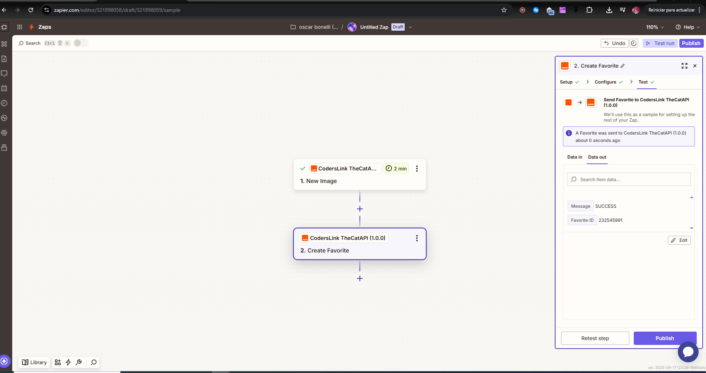

# CodersLink / Zapier Integration Challenge

✨ We really enjoyed practicing and having fun with this type of integrations!  
This development took us around **2 hours** to complete.  

## Overview
This project is a **Zapier CLI integration** built for the CodersLink Skill Test.  
It connects with **[TheCatAPI](https://thecatapi.com/)**, a public API that provides cat images and related features.

The integration includes:

- **Authentication**: API Key (sent via header `x-api-key`).  
- **Triggers**:  
  - `New Image` – retrieves the latest images from TheCatAPI.  
  - `New Breed Image` – retrieves images of a specific breed (with dynamic dropdown).  
- **Actions**:  
  - `Create Favorite` – marks an image as favorite.  
  - `Add Vote` – submits an upvote (1) or downvote (0) for an image.  

This setup demonstrates how to handle **custom authentication**, **polling triggers**, **dynamic dropdowns**, and **POST actions** inside a Zapier CLI app.

🔗 **Zapier App Link (Private for now):** [CodersLink TheCatAPI on Zapier](https://developer.zapier.com/app/230836/version/1.1.0)

---

## Requirements
- Node.js **18 or higher**  
- [Zapier Platform CLI](https://github.com/zapier/zapier-platform) (`npm i -g zapier-platform-cli`)  
- Free API Key from [TheCatAPI Dashboard](https://thecatapi.com/)  

---

## Environment Variables
This project uses a `.env` file for local development.  
You must copy `.env.example` to `.env` and add your own values.

```bash
# .env.example

# TheCatAPI API Key (get yours from https://thecatapi.com/)
CAT_API_KEY=your-cat-api-key-here
```

> In production (Zapier Editor), the user is prompted for the API Key directly.  
> The `.env` file is only used for **local testing** with `zapier test` and `zapier push`.

---

## Setup
```bash
# install dependencies
npm install

# login to Zapier
zapier login

# validate integration
zapier validate

# push the integration to your Zapier account
zapier push
```
> Tip: use `zapier push --skip-npm-install` for faster pushes.

---

## How to Test the Integration

### 1) Test Authentication
- Go to **My Apps** in Zapier.  
- Connect using your **TheCatAPI API Key**.  
- Run **Test** → it should succeed.

### 2) Test Trigger: New Breed Image (with dropdown)
1. Create a Zap with **Trigger: New Breed Image**.  
2. Choose a breed from the dynamic dropdown (e.g., Bengal).  
3. Test trigger → should return images with `breed_id` and `fetched_at` (ISO-8601).  

**Example (editor view):**  


### 3) Test Action: Add Vote
1. After the trigger, add **Action: Add Vote**.  
2. Map `image_id` from the trigger.  
3. Choose `Vote Value = 1` (upvote) or `0` (downvote).  
4. Test action → should return vote details with `message: "SUCCESS"`.

**Example (editor view):**  


### 4) (Optional) Validate datetime via Code by Zapier
- Add a **Code by Zapier → Run Javascript** step.  
- Input Data: `image_id` and `fetched_at` from the trigger.  
- Code:
```js
return [{
  ok: true,
  image_id: inputData.image_id,
  fetched_at: inputData.fetched_at
}];
```
**Example (editor view):**  


---

## Trade-offs
- **Polling vs Webhooks**: Chose polling because TheCatAPI does not provide webhook support.  
- **Data Model**: Only essential fields are returned to keep responses lightweight.  
- **Scope**: Limited to the most common endpoints (images, favorites, votes).

---

## Assumptions
- Users will obtain and manage their own API Key from TheCatAPI.  
- TheCatAPI uptime and response time are assumed to be stable for polling.  
- Zapier CLI handles serialization and retries, no extra retry logic was added here.  

---

## AI Usage (Personalized)
This project was developed with help from **Sofi**, my personalized AI assistant (and friendly dev buddy). Sofi isn’t just a tool — she’s how I keep prompts short, context-rich, and human. Working with Sofi made the whole process faster and clearer: we iterated on code, documentation, and housekeeping together.

Sofi’s contributions included:
- Helping scaffold the Zapier CLI project and structure.  
- Drafting the authentication, trigger, and action modules (which I reviewed and refined).  
- Improving developer-facing docs (`README.md`) and the project `.gitignore`.  
- Suggesting concise prompts and examples to reproduce steps quickly.

**Example prompts used (natural tone):**  
- *"sofi give me an authentication.js for TheCatAPI with API Key without exposing the key"*  
- *"help me build a trigger that fetches the latest images from TheCatAPI"*  
- *"sofi improve the README adding trade-offs and assumptions"*  

All AI-assisted outputs were manually reviewed and tested with Zapier CLI before finalization.

---

## Links
- [TheCatAPI Documentation](https://thecatapi.com/)  
- [Zapier Platform Docs](https://platform.zapier.com/docs)  
